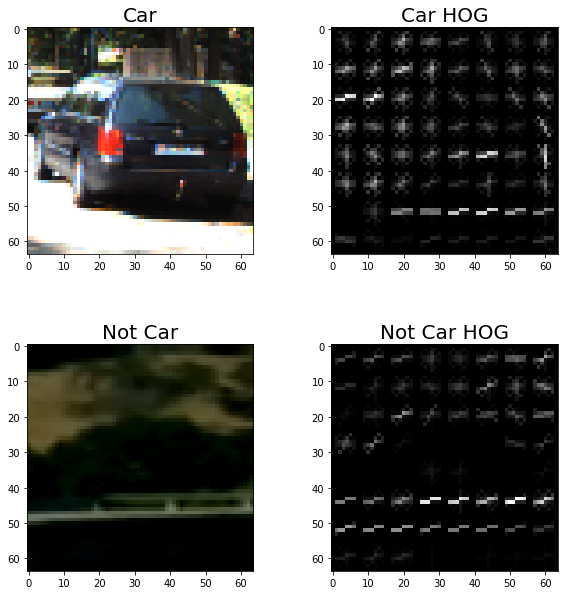
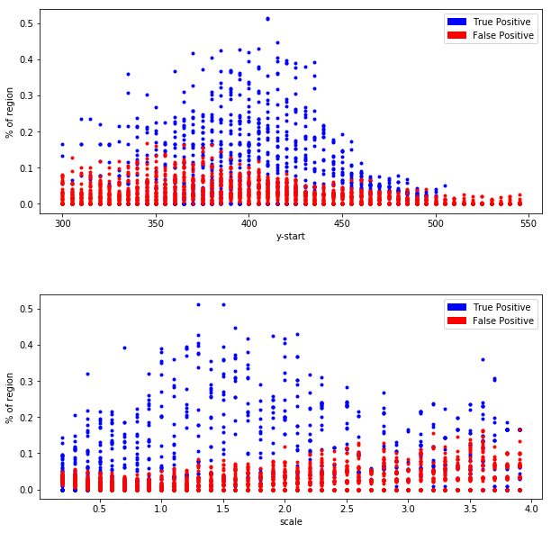
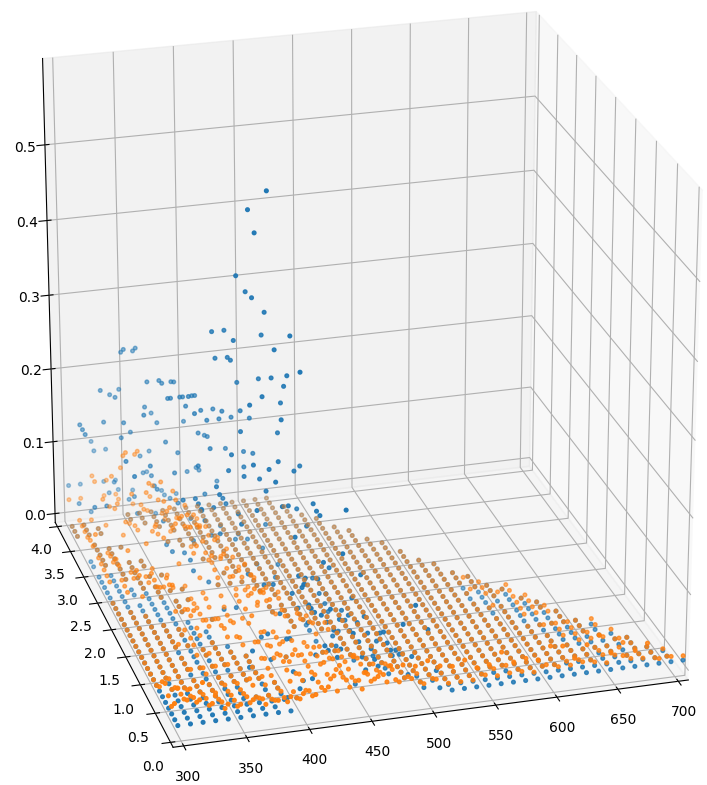
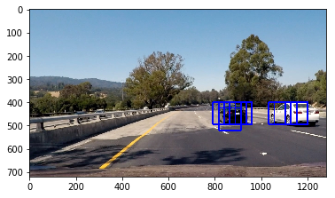
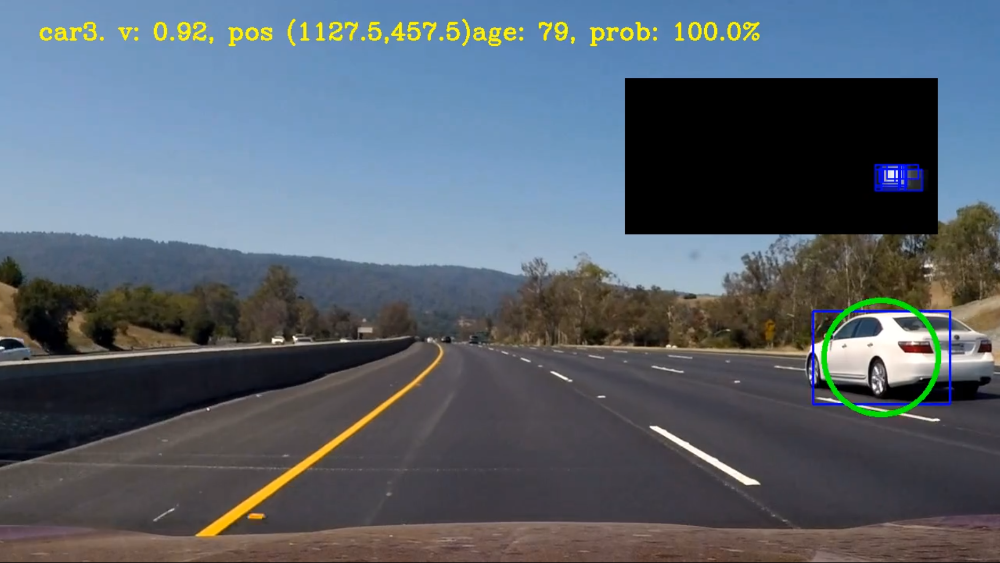
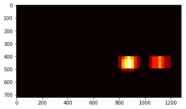

## Writeup Project5

**Vehicle Detection Project**

The goals / steps of this project are the following:

* Perform a Histogram of Oriented Gradients (HOG) feature extraction on a labeled training set of images and train a classifier Linear SVM classifier
* Optionally, you can also apply a color transform and append binned color features, as well as histograms of color, to your HOG feature vector. 
* Note: for those first two steps don't forget to normalize your features and randomize a selection for training and testing.
* Implement a sliding-window technique and use your trained classifier to search for vehicles in images.
* Run your pipeline on a video stream (start with the test_video.mp4 and later implement on full project_video.mp4) and create a heat map of recurring detections frame by frame to reject outliers and follow detected vehicles.
* Estimate a bounding box for vehicles detected.

## [Rubric](https://review.udacity.com/#!/rubrics/513/view) Points
### Here I will consider the rubric points individually and describe how I addressed each point in my implementation.  

---
### Writeup / README

#### 1. Provide a Writeup / README that includes all the rubric points and how you addressed each one.  You can submit your writeup as markdown or pdf.  [Here](https://github.com/udacity/CarND-Vehicle-Detection/blob/master/writeup_template.md) is a template writeup for this project you can use as a guide and a starting point.  

You're reading it!

### Histogram of Oriented Gradients (HOG)

#### 1. Explain how (and identify where in your code) you extracted HOG features from the training images.

This was simply done using the code from the lesson, which is using the hog method from  skimage.feature.

The code for this step is contained in the first code cell of the IPython notebook method get_hog_features (line50)  

I started by reading in all the `vehicle` and `non-vehicle` images.  Here is an example of one of each of the `vehicle` and `non-vehicle` classes:

#### 2. Explain how you settled on your final choice of HOG parameters.

I Planned to use a GA to evolve a good set of parameters, but something didn't work correctly so I ended up just running a few thousands sets of parameters overnight and then compare them.
to make it quicker i only took 2000 random samples (as recommended from our slack channel). This can be found in cell 4 in the notebook Project5.ipynb
(I did not save the huge amount of sets as it took way to much space in the notebook, I did copy it to a spreadsheet where I compared the settings, but forgot to save it), after cell 4 a small table can be found
beside just checking the accuracy score, I also added a `heatmap_accuracy` method that checked the provided test images to see how many %true positive and false positive I got for these. But realize this maybe was unnecessarily.

Beside the hog feature I also used the Spatial features and Histogram features as in the lesson.

#### 3. Describe how (and identify where in your code) you trained a classifier using your selected HOG features (and color features if you used them).

I started out by training with a linear svm classifier, but saw that many in the slack channel had got huge success with the MLPclassifier (neural network), and I did indeed get a much higher accuracy score (over 99%). So this is what I used as a final version... However, it did introduce some strange false positives which I had to solve using lots of hard negative mining. So I do consider changing to another classifier.
I also added a function for Augmented data, that I've used in previous projects, but I did notice that I got worse result so I removed all those.. Might look up why and add new again. 
The other features works out of the box from the lesson.

### Sliding Window Search

#### 1. Describe how (and identify where in your code) you implemented a sliding window search.  How did you decide what scales to search and how much to overlap windows?

I used the find_cars() function from the lesson with a few smaller adjustments. However, it seems that out of the box the it can't reach all the way to the bottom and side (e.g if we have 3 boxes that would overlap in one "step" all those 3 need to fit to be able to do it, which seems really strange, Think this is the reason I have problem tracking the car when too close to the edge,

#### 2. Show some examples of test images to demonstrate how your pipeline is working.  What did you do to optimize the performance of your classifier?

To find the best scale I did I short analyzing script that gave me the following graphs:

Here we can see that we will get the best result at around y=400, and the scale is best at 1.5

And if we look at it in 3D we can also see how the optimal scale increases when the y value increase, which makes sens an carn are bigger the further down (closer) they are.

In the end I ended up using 3 scales, 1, 1.5 and 1.6 using YCrCb 3-channel HOG features plus spatially binned color and histograms of color in the feature vector. This is the result:

---

### Video Implementation

#### 1. Provide a link to your final video output.  Your pipeline should perform reasonably well on the entire project video (somewhat wobbly or unstable bounding boxes are ok as long as you are identifying the vehicles most of the time with minimal false positives.)
Here's a [link to my video result](./test_videos_output/project_video_long.mp4)

It shows the following: 
Some information string, with velocity in px/frame, current position, age in frames, and a probability.
Based on the probability, it will either show no circle, or different color where blue is >95%.
the blue marker around the car is the raw label data box, so if only this exist our classifier and heat-map says it's a car, but our car class says no. One such occurrence is when the two cars passes, as our car class will say it's in fact not a car (this is by design, as two cars is not one car) Future version might include a method to be able to classify the two cars separate.

The black box shows the current heat-map, together with the raw boxes from the find_car() method.

#### 2. Describe how (and identify where in your code) you implemented some kind of filter for false positives and some method for combining overlapping bounding boxes.

To reduce the amount of false positives I first used a heat-map that I average overtime and used a threshold, this way the classified would need to classify the same spot several frames. An example of an heat-map can be seen here:

The heat-map was then turned into a labeled set using`scipy.ndimage.measurements.label()`.
I also had two classes that would keep track of all the previous classifications, these classes was called using the "Labels" above.
It will both keep track on how long it existed and remove false positives. It will also keep an image of the car in a 64x64 image, which will both be used to re-classify that the car really is a car and save to disk so we can use it as hard negative mining by adding these to the classifier.

#### Class carTracker
This class handles things relevant to all the cars (and later on also all the lines and perhaps other things too)
It stores a dictionary of all cars, and the input image that will be used by the car class.
`self.cars` - Dictionary of cars
`self.dist_pickle` From the pickle file containing the model and everything important
`self.image` Just the input image

 Methods:

* `__init__()` - Initialize the car tracker so we can keep track of future finding
* `add_car(bbox)` - This method will add a new car in using the `__init__`  the car class below
* `update_frame(image)` - Build the documentation site.i
* `update_cars(bbox)` - This will take each label and see which already existing car fits best, if found we will update this car using `update(bbox)`, otherwise we create a new car using `add_car(bbox)`
* `get_text()` - Return a string for all the cars by asking the car who they think they are and hopefully we'll get a nice response that we then return.
* `get_car_boxes(min_propability)` - Get all the cars that have atleast a probibility of `min_propability`%, default is 80%

#### Class car
This class handles each car. 
`self.id` - Just an Id to keep cars separated also used as key in the `cars` Dictionary
`self.pos`- Keeps track of current position 
`self.size`- The current Size of the "car"
`self.probability`- Determines how probable it really is a car and not a bush or something
`self.rel_speed`- Keep track of the current relative speed in pixels/frame
`self.alive_frame_counter`- The age of the car itself, like if it's a 2001 model or 2017 (ha just kidding, its just the number of frames)
`self.car_taken`- Same car cant be related to two labels 
`self.dist_pickle` - same as in `carTracker`
`self.image`- a 64 by 64 image of the car.

Methods:

* `__init__(bbox):` - This method will setup a new car using the bounding box data.
* `update(bbox)` - When a label finds a car, this is the method that will run, it does everything from updating new position and size to update its probability. If the probability is above 50%, the `self.image` needs to be reclassified as a car again by the classifier. i.e. it can never get the circle without passing this extra test.
* `who_are_you_mr_car():` - I'm a car, the car said carefully, but the carTracker wanted some more information about mr. Car and called this method.
* `update_car_frame(image):`- This is udated every frame regardless if we found it or not

---

### Discussion

#### 1. Briefly discuss any problems / issues you faced in your implementation of this project.  Where will your pipeline likely fail?  What could you do to make it more robust?

The classifier could get a bit better at not detection false positives to start with, and I would also want to add more data to it. Another problem I faced was memory issues when extracting features with parameters that should have been even better, but my 12GB ran out very quickly.. I don't know if I manage to do something or if it's something that "should" happen with this classifier.. but it feels really strange imho. 
Another interesting approach would be to use CNN, perhaps directly as in the car sign project.
Compared to other better methods, like YOLOv2, this is pretty bad and very very slow..
Another thin I thought of was to actually use something like explained in the writeup template to kinda actually just look around almost "randomly" in the area of interest with a "random" scale, and use a probability to be more likely to look where we have seen cars before, this way we dont have to check every single window position every frame and as such we can increase the speed tremendously !
